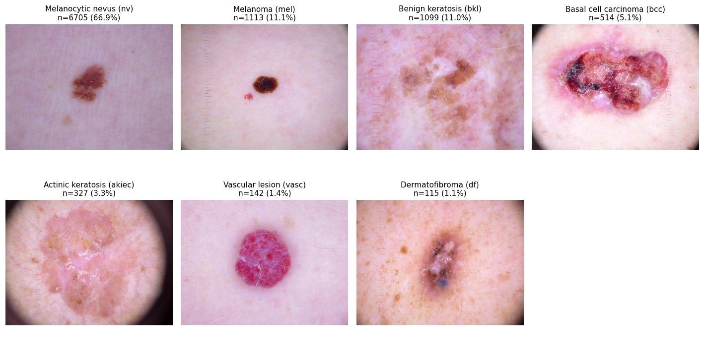
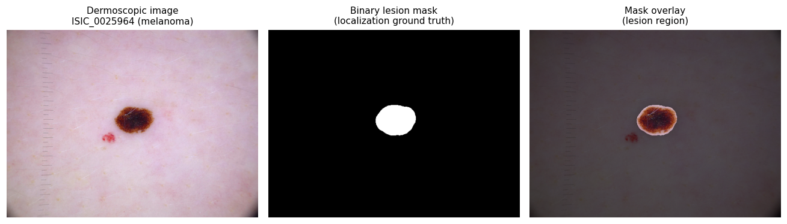

# Dataset: HAM10000

HAM10000 (Human Against Machine with 10000 training images) is a public collection of dermoscopic images used for skin lesion classification. We use it for both classification and, critically, for evaluating where each model looks via its lesion segmentation masks.

Source: Tschandl et al., 2018, Scientific Data. Harvard Dataverse DOI [10.7910/DVN/DBW86T](https://doi.org/10.7910/DVN/DBW86T), also mirrored on Kaggle.

Download it with `python scripts/download_data.py`, which lays the files out under `data/` as follows:

```
data/
  HAM10000_metadata
  HAM10000_images_part_1/      5000 jpgs
  HAM10000_images_part_2/      5015 jpgs
  HAM10000_segmentations_lesion_tschandl/   10015 masks
```

## What it contains

- 10,015 dermoscopic (skin-surface microscope) images, 600x450 RGB, resized to 224x224 for training.
- 7 diagnostic classes, labeled by histopathology or expert consensus.
- One binary lesion segmentation mask per image (Tschandl et al.), 1:1 with the images, pixel values {0, 255}. These are our ground truth for localization metrics.
- Metadata CSV with lesion_id, image_id, diagnosis (dx), age, sex, and lesion site.

## The seven classes (and why imbalance matters)



The classes are severely imbalanced. Melanocytic nevus alone is 67 percent of the data, while dermatofibroma is just over 1 percent.

| Class | Code | Count | Share |
|-------|------|-------|-------|
| Melanocytic nevus | nv | 6705 | 67.0% |
| Melanoma | mel | 1113 | 11.1% |
| Benign keratosis | bkl | 1099 | 11.0% |
| Basal cell carcinoma | bcc | 514 | 5.1% |
| Actinic keratosis | akiec | 327 | 3.3% |
| Vascular lesion | vasc | 142 | 1.4% |
| Dermatofibroma | df | 115 | 1.1% |

This imbalance is why we use weighted cross-entropy loss and report per-class metrics (AUC-ROC, macro F1, balanced accuracy) rather than raw accuracy.

## Segmentation masks: our localization ground truth

Every image ships with a binary mask marking the lesion region. This is the part of HAM10000 most central to our research question. We threshold each model's explanation heatmap and compare it against the mask to ask whether the model actually attends to the lesion rather than to background skin or artifacts.



- IoU: overlap between the thresholded heatmap and the lesion mask.
- Pointing game: whether the heatmap's peak falls inside the lesion mask.

## A subtlety that affects our split

There are 10,015 images but only 7,470 unique lesions, because some lesions are photographed more than once. A naive random split would scatter images of the same lesion across train and test, leaking information and inflating results. We therefore use a lesion-grouped stratified 80/10/10 split, assigning every image of a given lesion_id entirely to one split.

## What we do not use

The download also includes the ISIC 2018 Task 3 test set. We treat HAM10000 as our primary dataset and do not rely on the ISIC split for the core comparison.
